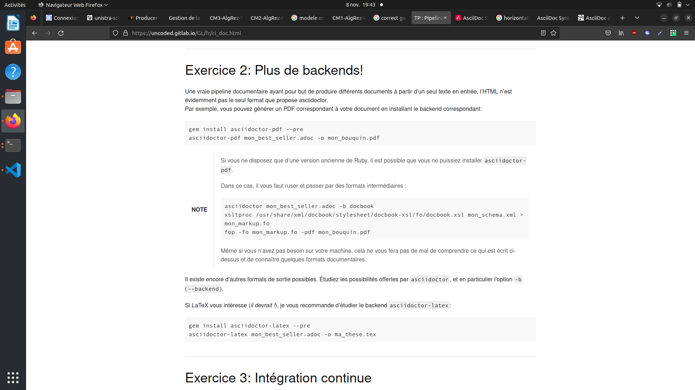

== Feuille asciidoc                              
:author: MOUAHEB Elias(c) 2022
:email: adresse@test.com
:icon: http://fontawesome.github.io/Font-Awesome/icons/
:sectnums:                                                          
:toc:                                                               
:toclevels: 4                                                       
:toc-title: Table des matières

[[anchor-1]]
=== [big]#Reproduction de l'exercice 1 du TP#

=== Exercice 1 : Prise en main d'Asciidoctor

Créez un fichier texte. En vous aidant des liens donnés en référence, rédigez un document quelconque.
Par exemple, écrivez une fausse documentation utilisateur, avec plusieurs chapitres incluant différentes sections. Insérez-y des images, des tableaux, des références vers d’autres chapitres ou des sites externes, des snippets de code, etc.
Vous pouvez aussi tenter de reproduire le https://uncoded.gitlab.io/GL/fr/ci_doc.html[présent sujet de TP] !

Nommez votre fichier comme vous le voulez ; la suite de ce TP partira du principe que vous l’avez nommé, en toute modestie, `mon_best_seller.adoc`.

De loin en loin, surveillez la progression et la syntaxe de votre document en générant la page web correspondante :

`asciidoctor mon_best_seller.adoc -o ma_page.html`

'''

=== Exercice 3: Intégration continue

==== Exercice 3.1: Build simple

    * Générer votre manuel utilisateur en un fichier index.html qui constitue le site web de votre projet.

    * Générer votre manuel utilisateur au format PDF et rendez-le disponible sur le site web de votre projet.

Effectuez cela en vous aidant de la plateforme https://about.gitlab.com/[GitLab] et des https://docs.gitlab.com/ee/user/project/pages/[GitLab Pages]. Tout ce que vous avez à faire, outre pusher le dépôt que vous avez utilisé aux exercices précédents sur GitLab, est de créer à la racine de votre dépôt un fichier nommé `.gitlab-ci.yml`.
".gitlab-ci.yml"

----
image: ruby

pages:
script:
- gem install compass zurb-foundation # CSS stylesheets generation
- gem install prawn -v 2.1.0
- gem install asciidoctor # HTML generation
# rajoutez ici la génération du index.html ainsi que du fichier pdf
# dans un sous-répertoire que vous nommerez "public"
artifacts:
    paths:
   - public
    only:
    - master
----

N’hésitez pas non plus à jeter un coup d’œil sur le dépôt de https://gitlab.com/uncoded/GL[votre support de cours] pour voir comment cela peut être fait ! Attention, votre support de cours fait certaines choses un peu différemment.

[qanda]
.Petite rectification
Pourquoi ne pas faire les autres exercices?::
    Parce qu'ils sont pareils, donc l'intérêt est moindre.
    Voici à quoi ressemble l'exo 2 pour comparer 

=== Section exemple

Pour se protéger des `Erreur de segmentation(core dumped)`.

.Table Title
|===
|X |H0 est correcte  | H0 est fausse

|On accepte H0
|1-Alpha
|H0 est fausse mais on l'accepte, risque de seconde espèce

|On rejette H0
|On rejette H0 alors qu'elle est correcte, risque de première espèce
|1- Beta
|===

=== Réferences:

https://chat.asciidoc.org[Discuss AsciiDoc,role=external,window=_blank]

https://chat.asciidoc.org[Discuss AsciiDoc^]

xref:anchor-1[Revenir en haut] +
Un message ? Envoyez-le à l'adresse {email}, sinon :
----
printf("A la prochaine");
return 0;
----
